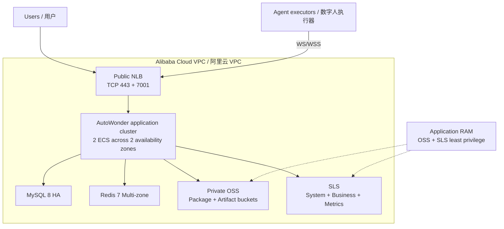
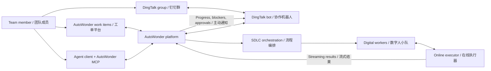

# AutoWonder Community

AutoWonder is a multi-agent software delivery platform. The community runtime is
self-contained and does not require Alibaba internal KMS, bootstrap, security,
artifact, or package infrastructure.

Deployment prerequisites, configuration, and verification commands are in the
[community runtime guide](docs/community/README.md).

## Recommended Deployment / 推荐部署架构

The recommended topology is a multi-zone HA deployment with two application
nodes and private data services.

## Collaboration Model / 平台工作模式

Users collaborate through the native work item platform, DingTalk groups, or a
personal Agent client connected through AutoWonder MCP.

Deployment details are in the
[community runtime guide](docs/community/README.md) and the
[Alibaba Cloud deployment Skill](skills/deploying-autowonder-on-alibaba-cloud/SKILL.md).
