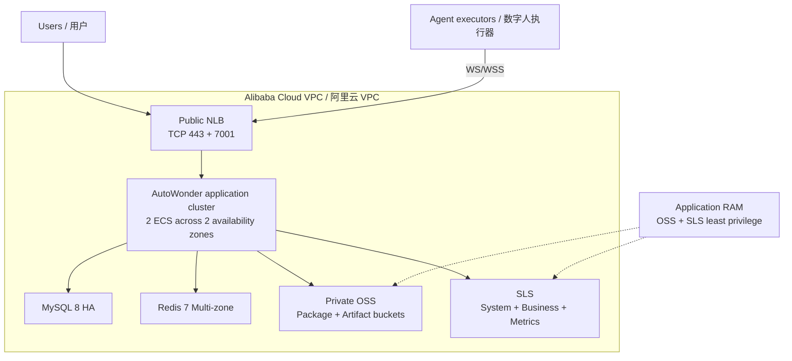
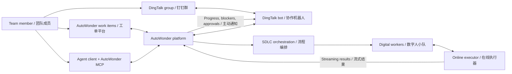

# AutoWonder Community

AutoWonder is a multi-agent software delivery platform. The community runtime is
self-contained and does not require Alibaba internal KMS, bootstrap, security,
artifact, or package infrastructure.

Deployment prerequisites, configuration, and verification commands are in the
[community runtime guide](docs/community/README.md).

## Recommended Deployment / 推荐部署架构

The recommended topology is a multi-zone HA deployment with two application
nodes and private data services.

## Collaboration Model / 平台工作模式

Users collaborate through the native work item platform, DingTalk groups, or a
personal Agent client connected through AutoWonder MCP.

## Model Guidance / 模型建议

| Digital workers | Recommended model | Context |
| --- | --- | --- |
| Development, Testing, Code Review / 开发、测试、CR | `Qwen3.8-Max` | 1M |
| DBA, Conflict Resolution, Requirement Clarification / DBA、冲突解决、需求澄清 | `GLM-5.2`, `DeepSeek-V4 Pro`, or `Qwen3.7-Max` | 400K |

Use the equivalent model name provided by the selected executor.

## Getting Started / 系统上手

1. Create an organization, then register the code repository / 创建组织后先托管代码仓库。
2. Start with the initialized `SDLC - 样板间` templates / 使用初始化的 SDLC 样板间。
3. Open **Avatar -> Personal Settings -> MCP Tokens** and connect the token to a personal Agent client / 在个人设置中创建 MCP 并挂载到本地 Agent 客户端。

Deployment details are in the
[community runtime guide](docs/community/README.md) and the
[Alibaba Cloud deployment Skill](skills/deploying-autowonder-on-alibaba-cloud/SKILL.md).
