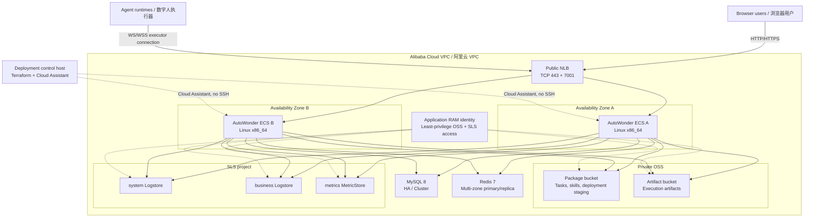
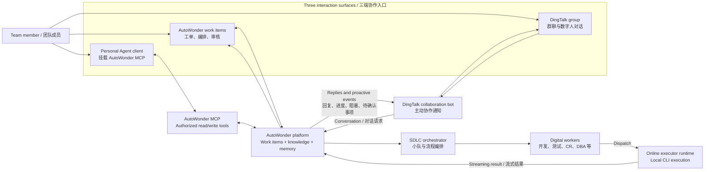

# AutoWonder Community

AutoWonder is a multi-agent software delivery platform. The community runtime is
self-contained and does not require Alibaba internal KMS, bootstrap, security,
artifact, or package infrastructure.

Deployment prerequisites, configuration, and verification commands are in the
[community runtime guide](docs/community/README.md).

## Recommended Deployment / 推荐部署架构

For production-like use, deploy the default multi-zone HA topology. The two ECS
nodes have no public IP or SSH access. Public traffic enters through the NLB,
while application data services stay on private network paths. Terraform creates
a least-privilege application RAM identity scoped to the two OSS buckets and the
SLS project.

The deployment Skill under
[`skills/deploying-autowonder-on-alibaba-cloud`](skills/deploying-autowonder-on-alibaba-cloud/SKILL.md)
is the source of truth for resource creation, initialization, verification, and
operations.

## Collaboration Model / 平台工作模式

AutoWonder provides three complementary interaction surfaces. Teams can work in
the native work item platform, talk to digital workers in a DingTalk group, or
use a personal Agent client connected through AutoWonder MCP. DingTalk is also
the proactive notification channel for progress, review requests, blockers, and
decisions that need a human.

The native platform remains the system of record. DingTalk and MCP provide
additional collaboration paths without creating a separate copy of work items,
artifacts, knowledge, or memory.

## Digital Worker Model Guidance / 数字人模型建议

Use the strongest long-context model on roles that directly determine delivery
quality. Supporting roles can use a more cost-efficient reasoning model while
retaining enough context for repository and work item analysis.

| Role class | Digital workers | Recommended model | Context window |
| --- | --- | --- | --- |
| Primary delivery flow / 主流程 | Development, Testing, Code Review (CR) | `Qwen3.8-Max` | 1M tokens |
| Supporting flow / 辅助流程 | DBA, Conflict Resolution, Requirement Clarification, and similar roles | `GLM-5.2`, `DeepSeek-V4 Pro`, or `Qwen3.7-Max` | 400K tokens |

Model identifiers depend on the executor provider and may differ from the names
shown above. Select the equivalent available model and verify its effective
context limit in the executor configuration.

## Getting Started / 系统上手流程

1. **Create an organization, then register the repository / 创建组织并托管仓库.**
   Repository registration should be the first organization-level setup step so
   digital workers can resolve code, branches, and repository context.
2. **Start from `SDLC - 样板间` / 使用初始化的 SDLC 样板间.**
   Use the initialized squad and SDLC templates as the first working baseline,
   then adapt roles, prompts, quality gates, and workflow steps to the team.
3. **Connect your personal Agent client / 挂载个人 MCP.**
   Open **Avatar / 个人头像 -> Personal Settings / 个人设置 -> MCP Tokens**, create
   a personal MCP token, and configure it in your local Agent client. This makes
   repository, work item, digital worker, knowledge, and memory management
   available from the client. Treat the token as a secret and do not commit or
   paste it into logs.
