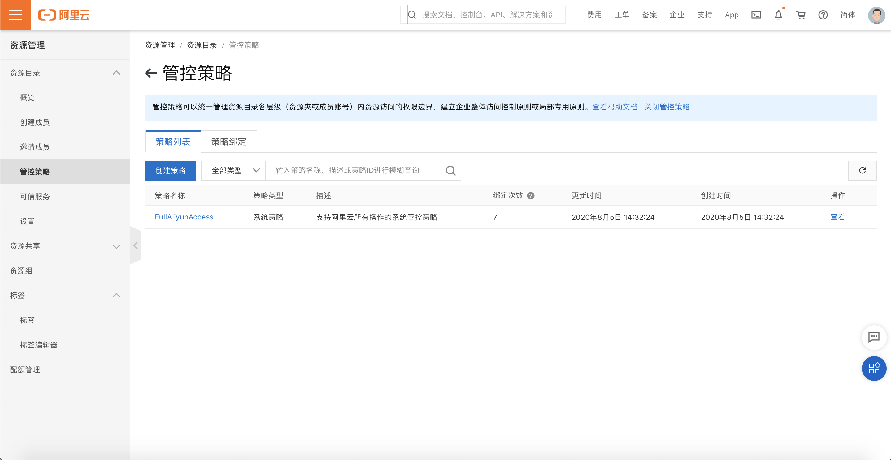
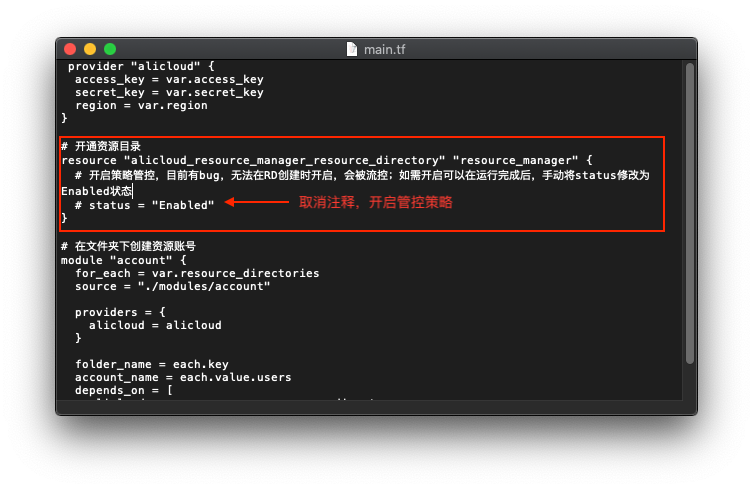
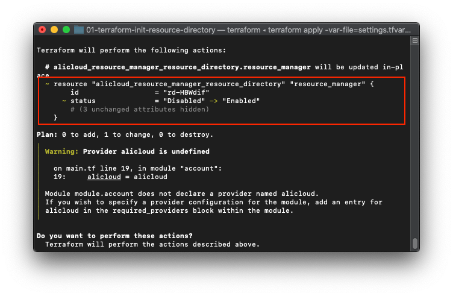
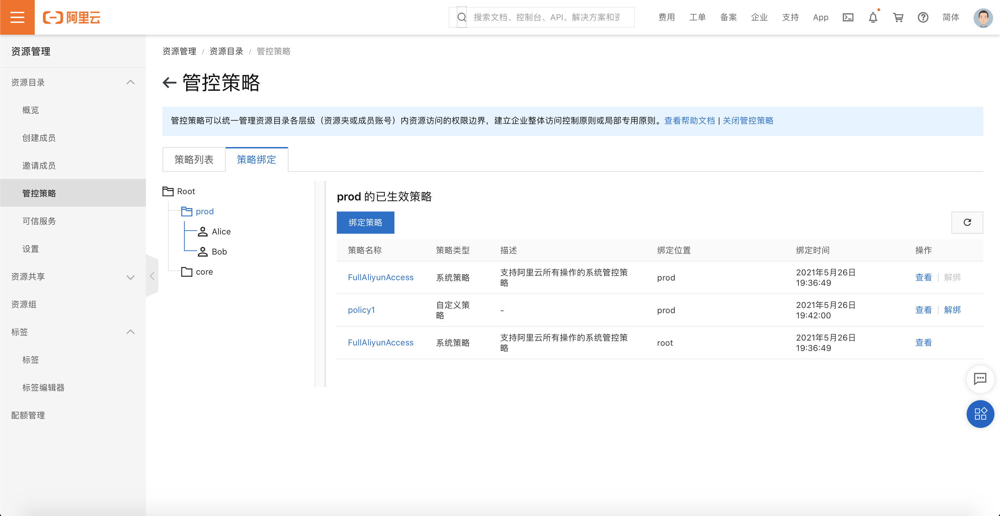

# 自动化为资源目录下发策略

## 方案介绍

本方案使用Terraform自动化执行，使用Terraform，创建新的管控策略（ControlPolicy），并且绑定在用户指定的资源夹下。

## 前置条件

- 确保在当前环境已经安装Terraform，并且版本 >= 0.13。

- 确保已持有用户AK且用户有权限完成操作。进入主账号，创建用户并生成AK，并且赋予该账号AliyunResourceDirectoryFullAccess权限。

- 确保用户已经开启**资源目录服务**，同时开通资源目录下的**管控策略服务**

  - 如果已经执行01-资源目录初始化操作，此时还**未开通**管控策略服务，有以下两种方式开通管控策略

    1. 进入资源目录控制台，在"策略管控"页面点击开通策略管控服务

       

    2. 修改01-资源目录初始化操作目录下的main.tf文件，在RD的resource下将status设置为Enabled，再次运行`terraform apply -var-file=settings.tfvars -parallelism=1`即可

       

       

       

## 操作步骤

1. 下载代码，解压到某个目录

2. 用编辑器打开settings.tfvars文件，修改文件的配置项

   - 将**前置条件**中的AK、AK Secret填入到`access_key`, `secret_key`内

   - 根据自身需要修改`control_policy`和`directory_regex`配置。

     ```json
     # 策略名称
     control_policy_name = "policy1"
     # 策略描述
     description = ""
     # 策略作用范围
     effect_scope = "RAM"
     # 策略配置
     policy_document = {
       "Version":"1",
       "Statement": [
         {
           "Effect":"Deny",
           "Action": [
             "ram:UpdateRole",
             "ram:DeleteRole",
             "ram:AttachPolicyToRole",
             "ram:DetachPolicyFromRole"
           ],
           "Resource":"acs:ram:*:*:role/ResourceDirectoryAccountAccessRole"
         }
       ]
     }
     
     # 绑定的资源夹的正则表达式
     directory_regex = "prod"
     ```

3. 在目录下运行`terraform init`

4. 运行`terraform plan -var-file=settings.tfvars`，检查是否报错，如果报错，请检查第二步中的配置项是否正确；

   

5. 运行`terraform apply -var-file=settings.tfvars -parallelism=1`，自检成功后输入 *yes* 开始运行。运行成功后检查策略是否成功创建，并且绑定到指定资源夹下。

   

   6. 控制台检查策略是否创建并绑定成功。

      

