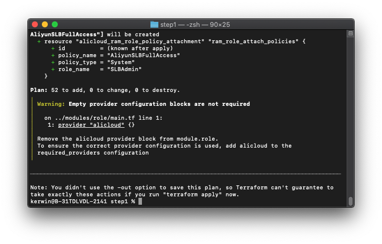
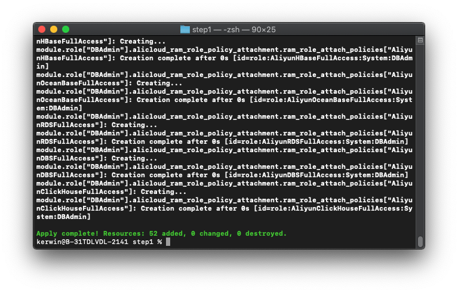
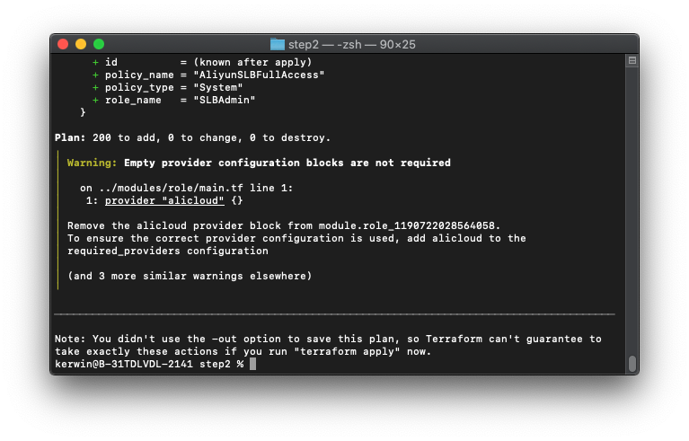
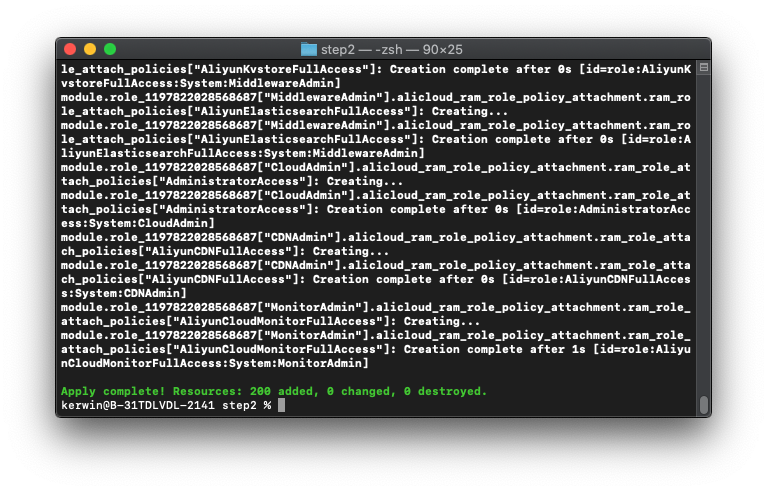
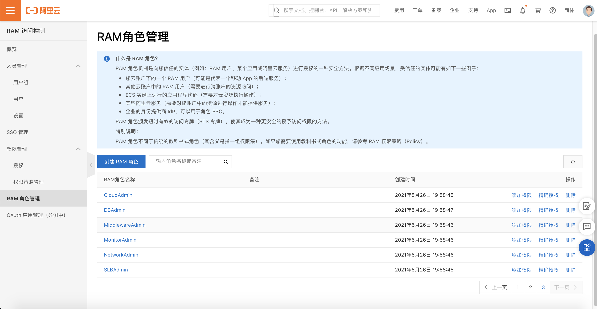

# 自动化为企业成员账号创建角色

## 方案介绍

本方案使用 Terraform 自动化执行，受限于 Terraform 的一些限制（不支持动态 Provider），需要分为两步进行，第一步执行会在「企业管理账号」下遍历所有成员账号，在企业管理账号下创建角色，并动态生成出第二步所需的 Terraform 模板并自动化填写好参数，然后再执行生成好的模板，为每个成员账号创建 RAM 角色并赋予权限（创建的RAM角色的可信实体为「企业管理账号」）。所有的配置项均在第一步内完成。

## 前置条件

- 确保当前环境已经安装 Terraform，并且版本 >= 0.13；
- 确保已持有用户AK且用户有权限完成操作。进入主账号，创建用户并生成AK，并且赋予该账号AliyunResourceDirectoryReadOnlyAccess、AliyunSTSAssumeRoleAccess、AliyunRAMFullAccess权限。
- 确保用户已经开启**资源目录服务**

## 操作步骤

1. 下载附件的代码包，解压到某个目录。目录结构如下：

   ```
   ├── modules             // 模块目录，无需修改
   │   └── role            // 创建角色相关的操作封装为模块便于使用，无需修改
   │       ├── main.tf 
   │       └── variables.tf
   └── step1               // 第一阶段操作所需的目录
       ├── main.tf         // 第一阶段操作入口文件，无需修改
       ├── settings.tfvars // 配置文件，可以根据自身需要修改
       ├── step2.tmpl      // 用于生成第二阶段操作的模板文件，无需修改
       ├── variables.tf    // 第一阶段用到的变量定义，无需修改
       └── versions.tf     // 声明第一阶段用到的依赖版本，无需修改
   ```

2. 使用编辑器打开 `step1/settings.tfvars` 这个文件，根据注释，修改该文件内的配置项：

   - 将**前置条件**中的AK、AK Secret填入到`access_key`, `secret_key`内

   - 根据自身需要修改 `ram_roles` 角色列表，运行脚本后，会自动化创建这里定义的这些角色并赋予对应的权限。

     ```json
     # AK
     access_key = "***************"
     # AK Secret
     secret_key = "***************"
     # API 调用地域
     region = "cn-hangzhou"
     
     # 需要创建的 RAM 角色列表
     ram_roles = {
       # 角色名称，需要唯一
       "BillingAdmin": {
         # 角色描述，可以不填
         description = ""
         # 需要授权的权限列表
         policies = [
           "AliyunBSSFullAccess",
           "AliyunFinanceConsoleFullAccess"
         ]
       },
       ...
     }
     
     ```

3. 第一阶段操作：

   - 进入 `step1` 目录，然后运行 `terraform init` ；
   - 运行 `terraform plan -var-file=settings.tfvars` ，检查是否有报错，如果有报错，请检查第二步中的配置项是否正确；

   

   - 运行 `terraform apply -var-file=settings.tfvars -parallelism=1` ，自检成功后输入 yes 开始运行。运行成功后，根目录下会生成 `step2` 目录并包含 `main.tf` 等文件

     

4. 第二阶段操作：

   - 进入 `step2` 目录，运行 `terraform init` 初始化；

   - 运行 `terraform plan`，检查是否有报错；

     

   - 运行 `terraform apply -parallelism=1` ，自检成功后输入 yes 开始运行；

     

   - 运行成功后，到控制台检查是否所有成员账号的角色创建完成；如果有报错，一般是因为控制台上已经创建过相同名称的角色，建议在控制台上删除同名角色后重新运行上一步；

     