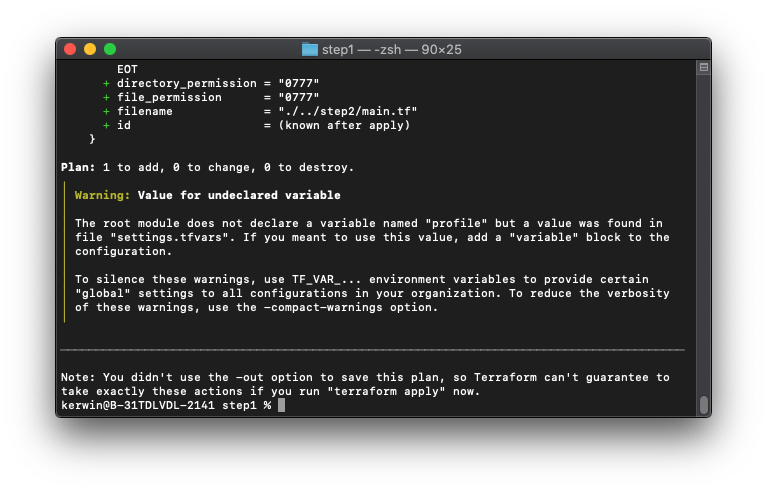
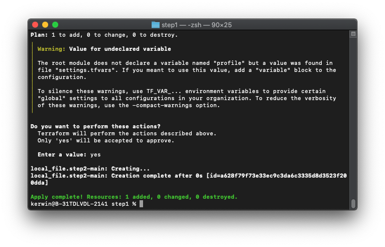
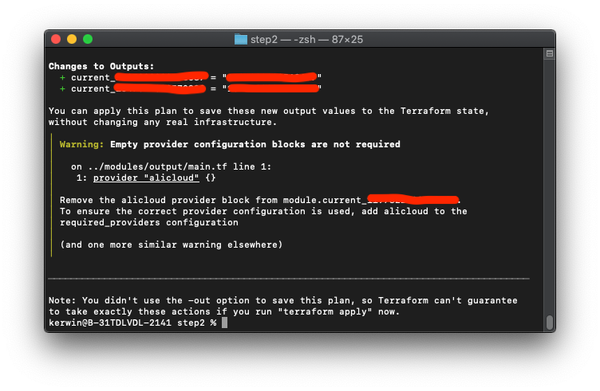
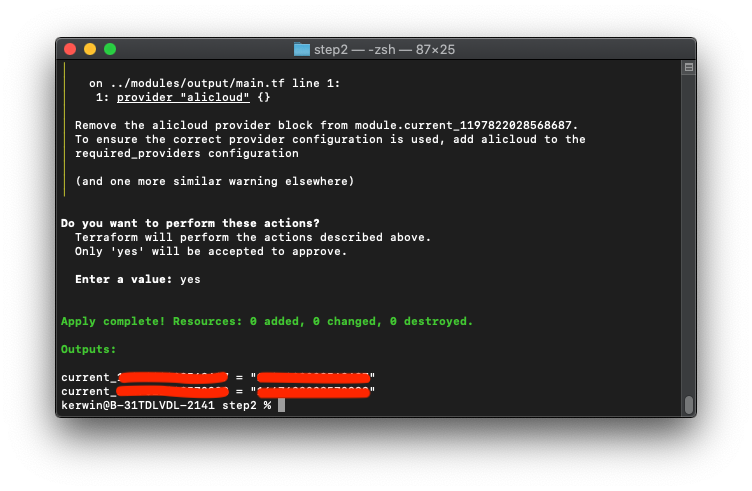

# 用户跨账号扮演角色模板

## 方案介绍

本方案使用 Terraform 自动化执行，受限于 Terraform 的一些限制（不支持动态 Provider），需要分为两步进行：第一步执行将根据settings.tfvars中用户指定要扮演的角色，动态生成出第二步所需要的Terraform模板并自动化填好参数；第二步将根据Terraform模板扮演RAM角色，并打印所扮演角色的账号uid。

## 前置条件

- 确保当前环境已经安装 Terraform，并且版本 >= 0.13；
- 确保已持有用户AK且用户有权限完成操作。进入主账号，创建用户并生成AK，并且赋予该账号AliyunResourceDirectoryReadOnlyAccess、AliyunSTSAssumeRoleAccess、AliyunRAMFullAccess权限。
- 确保被扮演角色的**可信实体**为该用户

## 操作步骤

1. 下载附件的代码包，解压到某个目录。目录结构如下：

   ```
   ├── modules             // 模块目录，无需修改
   │   └── output          // 打印当前角色所在账号的uid，无需修改
   │       ├── main.tf 
   │       └── variables.tf
   └── step1               // 第一阶段操作所需的目录
       ├── main.tf         // 第一阶段操作入口文件，无需修改
       ├── settings.tfvars // 配置文件，可以根据自身需要修改
       ├── step2.tmpl      // 用于生成第二阶段操作的模板文件，无需修改
       └── variables.tf    // 第一阶段用到的变量定义，无需修改
   ```

2. 使用编辑器打开 `step1/settings.tfvars` 这个文件，根据注释，修改该文件内的配置项：

   - 将**前置条件**中的AK、AK Secret填入到`access_key`, `secret_key`内

   - 根据自身需要修改 `ram_roles` 角色列表，运行脚本后，该用户将会去扮演指定账号下的指定角色

     ```json
     ram_roles = [
       {
         # 将扮演的角色名称
         role_name = "cloudadmin"
         # 角色所在账号uid
         account_id = "1***************"
       },
       { role_name = "networkadmin"
         account_id = "1***************"
       }
     ]
     ```

3. 第一阶段操作：

   - 进入 `step1` 目录，然后运行 `terraform init` ；

   - 运行 `terraform plan -var-file=settings.tfvars` ，检查是否有报错，如果有报错，请检查第二步中的配置项是否正确；

     

   - 运行 `terraform apply -var-file=settings.tfvars` ，自检成功后输入 yes 开始运行。运行成功后，根目录下会生成 `step2` 目录并包含 `main.tf` 等文件

     

     

4. 第二阶段操作：

   - 进入 `step2` 目录，运行 `terraform init` 初始化；

   - 运行 `terraform plan`，检查是否有报错；

     

   - 运行 `terraform apply -parallelism=1` ，自检成功后输入 yes 开始运行；

   - 运行成功后，检查是否成功打印角色uid。如成功显示各角色所在账号的uid，即表明当前用户成功扮演不同账号中的不同角色。

     

