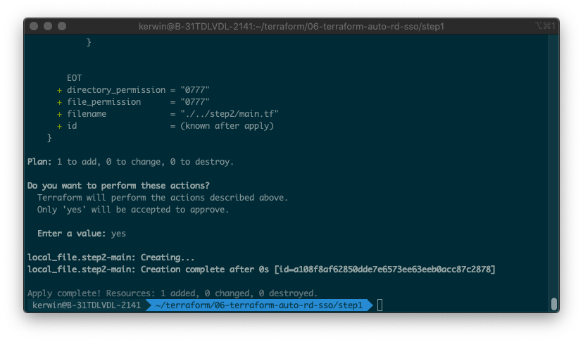
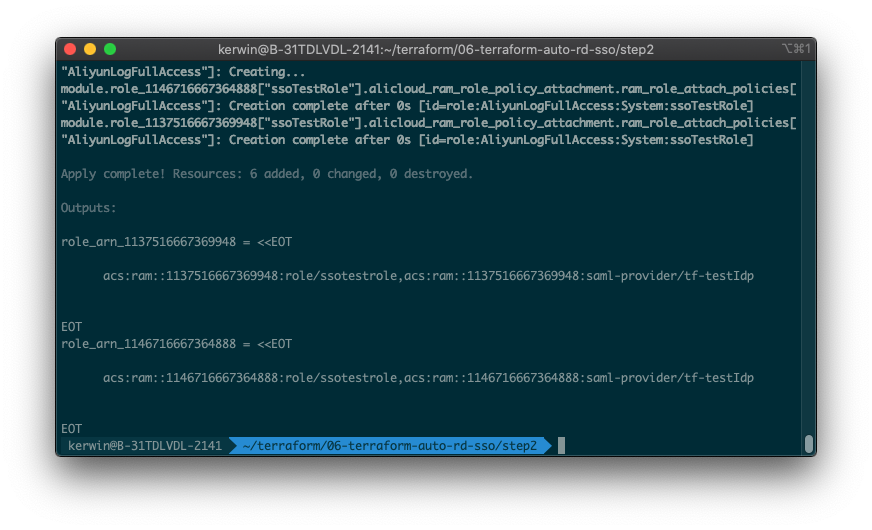

# 多账号SSO自动化配置

中文｜[English](./README_en.md)

## 方案介绍

本方案使用 Terraform 自动化执行，受限于 Terraform 的一些限制（不支持动态 Provider），需要分为两步进行：第一步执行将根据**主账号**资源目录下的成员账号列表，动态生成出第二步所需要的Terraform模板并自动填好参数；第二步将根据Terraform模板，在成员账号下创建Idp和RAM角色。所有配置项均在第一步内完成。

## 前置条件

- 确保当前环境已经安装Terraform
- 确保企业管理账号已经开启资源目录服务
- 确保已持有企业管理账号RAM用户AK且用户有权限完成操作。用户需要有AliyunResourceDirectoryReadOnlyAccess、AliyunSTSAssumeRoleAccess、AliyunRAMFullAccess权限。
- 确保已经获得Idp meta.xml元数据文件

## 操作步骤

1. 下载附件的代码包，解压到某个目录。目录结构如下：

   ```
   ├── modules             // 模块目录，无需修改
   │   └── role            // 创建角色相关的操作封装为模块便于使用，无需修改
   │       ├── main.tf 
   │       └── variables.tf
   └── step1               // 第一阶段操作所需的目录
       ├── main.tf         // 第一阶段操作入口文件，无需修改
       ├── settings.tfvars // 配置文件，可以根据自身需要修改
       ├── step2.tmpl      // 用于生成第二阶段操作的模板文件，无需修改
       └── variables.tf    // 第一阶段用到的变量定义，无需修改
   ```

2. 使用编辑器打开 `step1/settings.tfvars` 这个文件，根据注释，修改该文件内的配置项：

   - 将**前置条件**中的AK、AK Secret填入到`access_key`, `secret_key`内

   - 根据自身需要修改 `ram_roles` 角色列表，运行脚本后，会自动化创建这里定义的这些角色并赋予对应的权限。

     ```tfvars
     # 角色列表
     ram_roles = {
       "ssoTestRole": {
         description = "Test for Terraform"
         policies = [
           "AliyunLogFullAccess"
         ]
       }
     }
     ```

   - 根据自身需要修改idp配置信息，其中`metadata`存放Idp xml元文件路径

     ```tfvars
     # idp名称
     saml_provider_name = "tf-testIdp"
     
     # idp元数据xml文件路径
     metadata = "./meta.xml"
     ```

   - 根据自身需要填写子账号黑名单（使用子账号uid标识），在黑名单内的子账号不会创建idp和ram角色。

     ```tfvars
     # 子账号黑名单，填写子账号uid，在黑名单内的子账号不会创建idp和ram角色。
     exclude = ["113************"]
     # 期望作用在所有子账号上则配置exclude=[]即可。
     # exclude = []
     ```

3. 第一阶段操作：

   - 进入 `step1` 目录，然后运行 `terraform init` ；

   - 运行 `terraform plan -var-file=settings.tfvars` ，检查是否有报错，如果有报错，请检查第二步中的配置项是否正确；

   - 运行 `terraform apply -var-file=settings.tfvars -parallelism=1` ，自检成功后输入 yes 开始运行。运行成功后，根目录下会生成 `step2` 目录并包含 `main.tf` 等文件

     

4. 第二阶段操作：

   - 进入`step2`目录，运行`terraform init`初始化；

   - 运行`terraform plan`，检查是否报错；

   - 运行`terraform apply`，自检成功后输入*yes*开始运行。运行成功后会在控制台打印各个成员账号下创建的角色arn和idp arn（格式是`role arn,idp arn`）

       

