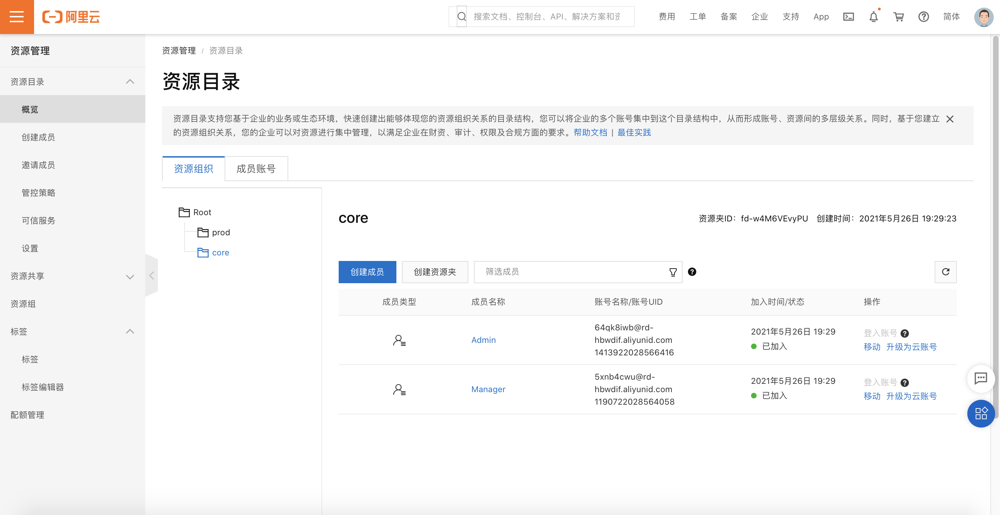

# 自动化从主账号初始化资源目录

## 方案介绍

本方案使用Terraform自动化执行，使用Terraform在用户指定的主账号下自动开通资源目录，按照用户需求创建文件夹，并且在文件夹中创建资源账号。

## 前置条件

- 确保在当前环境已经安装Terraform。

- 确保已持有用户AK且用户有权限完成操作。进入主账号，创建一个用户并且生成AK，并赋予该账号AliyunResourceDirectoryFullAccess权限。

  

## 操作步骤

1. 下载代码，解压到某个目录

2. 用编辑器打开settings.tfvars文件，修改文件的配置项

   - 将**前置条件**中的AK、AK Secret填入到`access_key`, `secret_key`内

   - 根据自身需要修改`resource_directories`内容文件夹列表以及文件夹下的用户

     ```
     # 创建文件夹和资源账号
     # 创建"prod"和"core"文件夹
     # "prod"下有账号"Prod", "Pre-prod", "Dev", "Test", "core"下有账号"Shared Service", "Security", "Networking", "Audit"
     resource_directories = {
       "prod": {
         accounts = ["Prod", "Pre-prod", "Dev", "Test"]
       },
       "core": {
         accounts = ["Shared Service", "Security", "Networking", "Audit"]
       }
     }
     
     ```

3. 在目录下运行`terraform init`

4. 运行`terraform plan -var-file=settings.tfvars`，检查是否报错，如果报错，请检查第二步中的配置项是否正确；

   

5. 运行`terraform apply -var-file=settings.tfvars -parallelism=1`，自检成功后输入 *yes* 开始运行。运行成功后检查资源目录是否开启，以及所有文件夹和成员账号是否成功创建。

   

6. 控制台检查资源目录是否成功开通并且创建资源夹和用户

      
      
7. 创建完成后若要删除资源账号，需先在控制台将其升级为云账号，无法直接用`terraform destroy`直接删除。

