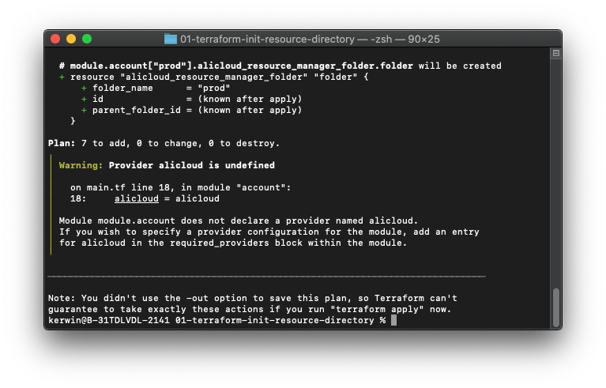
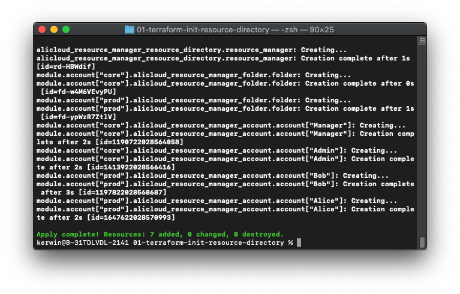

# Automatically initialize resource directories by using the Alibaba Cloud account

[中文](./README.md)｜English

## Solution overview

This solution uses Terraform for automated execution. You can enable resource directories in the specified Alibaba Cloud account, create folders, and further creates resource accounts in the folders based on your requirements by using Terraform. 

## Prerequisites

-	Terraform is installed in the current environment. 
-	The AccessKey pair of the RAM user is obtained. The RAM user is granted permissions to assume RAM roles. To meet these requirements, create a RAM user in your management account and generate an AccessKey pair for the RAM user. Then, attach the `AliyunResourceDirectoryFullAccess` policy to the RAM user. 

## Procedure

- Step 1 Download the code package and decompress it to a directory.
- Step 2 Open the settings.tfvars file by using the editor and modify the configuration items in the file.
  -	Set `access_key` and `secret_key` respectively to the values of AccessKey ID and AccessKey secret in prerequisites.
  -	Modify the folder list in `resource_directories` and the users in the folders based on your needs.
```
# Create folders and resource accounts.
# Create the prod and core folders.
# prod has the Prod, Pre-prod, Dev, and Test accounts. core has the Shared Service, Security, Networking, and Audit accounts.
resource_directories = {
  "prod": {
    accounts = ["Prod", "Pre-prod", "Dev", "Test"]
  },
  "core": {
    accounts = ["Shared Service", "Security", "Networking", "Audit"]
  }
}
```

- Step 3 Run the `terraform init` command in the directory.
- Step 4 Run the `terraform plan -var-file=settings.tfvars` command and check whether any error occurs. If an error occurs, check whether the configuration items are valid in Step 2.

- Step 5 Run the `terraform apply -var-file=settings.tfvars -parallelism=1` command. Enter yes after the self-check succeeds. When the command is executed successfully, check whether the resource directories are enabled, and check whether all folders and member accounts are created. 

- Step 6 Check whether the resource directories are enabled and whether the resource folders and users are created in the console.
- Step 7 To delete a resource account after it is created, upgrade the account to an Alibaba Cloud account in the console. You cannot directly delete it by using the `terraform destroy` feature. 
