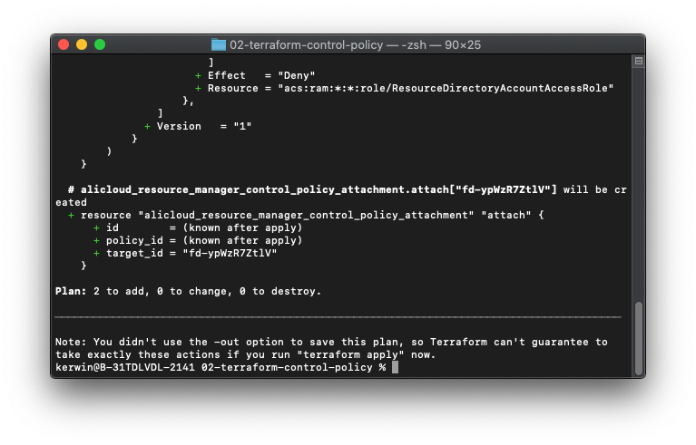
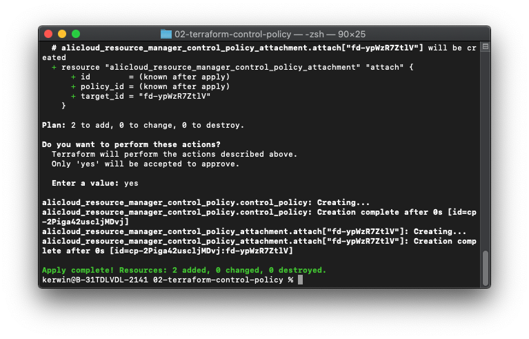

# Automatically create and attach policies to member accounts in the resource directories

[中文](./README.md)｜English

## Solution overview

This solution uses Terraform automation. It uses Terraform to create a new access control policy and bind it to the resource folder specified by the user. 

## Prerequisites

-	Terraform is installed in the current environment. 
-	You have obtained the AccessKeys of RAM users in the management account, and the users have permissions to complete the operations. Go to the Alibaba Cloud account, create a RAM user, generate an AccessKey, and grant the user the `AliyunResourceDirectoryFullAccess` permission. 
-	The resource directory service is enabled for the user, and the access control policy service in resource directories is also enabled.

## Procedure
1.	Download the code and decompress it to a directory.
2.	Open the `settings.tfvars` file with the editor and modify the configuration items in the file.
  -	Set access_key and secret_key respectively to the values of AccessKey ID and AccessKey secret in prerequisites.
  -	Modify the `control_policy` and `resource_manager_folder_ids` configurations based on your needs. 
```
# Policy name
control_policy_name = "policy1"
# Policy description
description = ""
# Scope where the policy takes effect
effect_scope = "RAM"
# Policy configurations
policy_document = {
  "Version":"1",
  "Statement": [
    {
      "Effect":"Deny",
      "Action": [
        "ram:UpdateRole",
        "ram:DeleteRole",
        "ram:AttachPolicyToRole",
        "ram:DetachPolicyFromRole"
      ],
      "Resource":"acs:ram:*:*:role/ResourceDirectoryAccountAccessRole"
    }
  ]
}

# The ID group of the bound resource folder
resource_manager_folder_ids = ["fd-Zn1wkx2Dws","fd-5wKgZmg0ng"]
```
3.	Run the `terraform init` command in the directory.
4.	Run the `terraform plan -var-file=settings.tfvars` command and check whether any error occurs. If an error occurs, check whether the configuration items are valid in Step 2.

5.	Run the `terraform apply -var-file=settings.tfvars` command. Enter `yes` after the self-check succeeds. When the command is executed successfully, check whether the policy is created and bound to the specified resource folder. 

6.	You can check whether the policy is created and bound in the console. 
