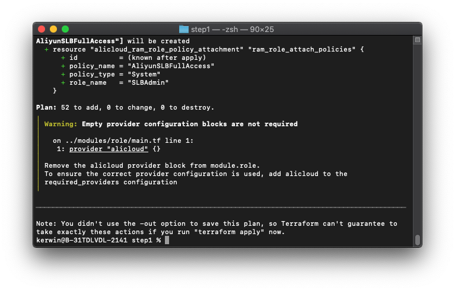
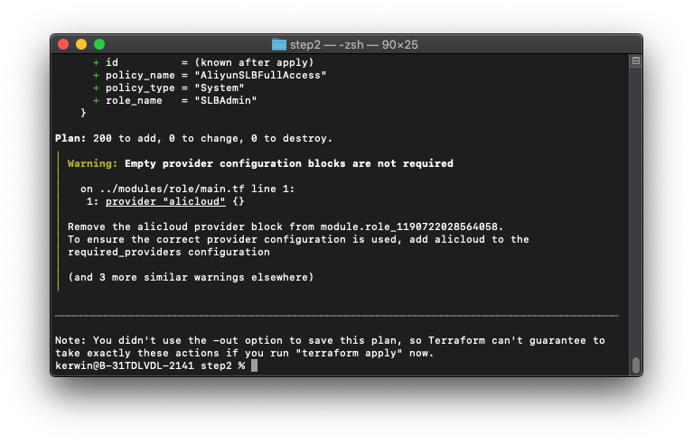

# Automatically create roles for member accounts

[中文](./README.md)｜English

## Solution overview

This solution uses Terraform for automated execution. Because Terraform does not support dynamic providers, the process to assume RAM roles consists of two phases. In the first phase, all member accounts are traversed in the management account, roles are created in the management account, and a Terraform template is automatically generated based on the configured parameters. In the second phase, the RAM user assumes the RAM roles specified in the Terraform template. The trusted entity for the created RAM roles is the management account. 

## Prerequisites

-	Terraform is installed in the current environment, and the version is 0.13 or later.
-	The AccessKey pair of the RAM user is obtained. The RAM user is granted permissions to assume RAM roles. To meet these requirements, create a RAM user in your management account and generate an AccessKey pair for the RAM user. Then, attach the AliyunResourceDirectoryReadOnlyAccess, AliyunSTSAssumeRoleAccess, and AliyunRAMFullAccess policies to the RAM user. 
-	The resource directory is enabled for the user.

## Procedure

1. Step 1 Download the code package of the attachment and decompress it to a directory. The directory structure is as follows:
```
├── modules             // Module directory. Do not modify it.
│ ├── role // The operations to create a role are encapsulated as a module, which is easy to use. Do not modify it.
│       ├── main.tf 
│       └── variables.tf
└── step1               // The directory required in phase 1.
    ├── main.tf         // The entry file used in phase 1. Do not modify it.
    ├── settings.tfvars // The configuration file. You can modify it as required.
    ├── step2.tmpl      // The file is used to generate the template file for operations in phase 2. Do not modify it.
    ├── variables.tf     // The definitions of variables used in phase 1. Do not modify them.
└ ── versions.tf // The dependency version used in phase 1. Do not modify it.
```
2. Step 2 Open the `step1/settings.tfvars` file and modify configuration items in the file based on the comments.
  -	Set access_key and secret_key respectively to the values of AccessKey ID and AccessKey secret in prerequisites.
  -	Modify the ram_roles list based on your needs. After you run the script, the roles defined are automatically created and granted corresponding permissions. 
```
# AK
access_key = "***************"
# AK Secret
secret_key = "***************"
# API call region
region = "cn-hangzhou"

# The RAM role list to be created
ram_roles = {
# The name of the role, which must be unique.
  "BillingAdmin": {
# The description of the role. You can leave this parameter unspecified.
    description = ""
# The list of permissions to be granted
    policies = [
      "AliyunBSSFullAccess",
      "AliyunFinanceConsoleFullAccess"
    ]
  },
  ...
}
```
3. Step 3 Perform the following operations in phase 1:
  -	Go to the `step1` directory and run the `terraform init` command.
  -	Run the `terraform plan -var-file=settings.tfvars` command and check whether any error occurs. If an error occurs, check whether the configuration items are valid in Step 2.
  
  -	Run the `terraform apply -var-file=settings.tfvars -parallelism=1` command. Enter yes after the self-check succeeds. When the command is executed successfully, a directory containing the `main.tf` file is generated in the root directory in `step2`.
  
4. Step 4 Perform the following operations in phase 2:
  -	Go to the `step2` directory and run the `terraform init` command.
  -	Run the `terraform plan` command and check whether an error occurs.
  
  -	Run the `terraform apply -parallelism=1` command. Enter yes after the self-check succeeds.
  
  -	After the operation succeeds, go to the console to check whether the roles of all member accounts are created. If an error occurs, it is generally because a role with the same name has been created in the console. We recommend that you delete the role with the same name in the console and then run the previous step again.
