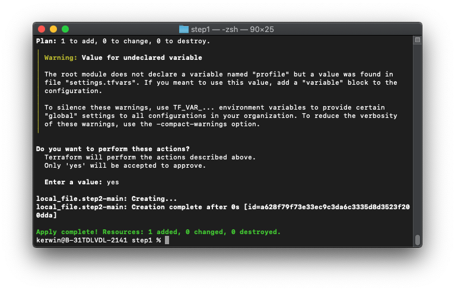
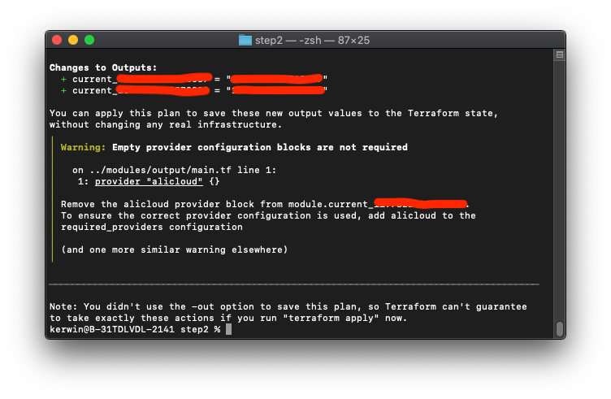

# Assume RAM roles within other Alibaba Cloud accounts

[中文](./README.md)｜English

## Background information

This example uses Terraform for automated execution. Because Terraform does not support dynamic providers, the process to assume RAM roles consists of two phases. In the first phase, a Terraform template is automatically generated based on the parameters that you configure in the settings.tfvars file. In the second phase, the RAM user assumes the RAM roles specified in the Terraform template. Then, the Alibaba Cloud Resource Name (ARN) of each assumed RAM role will be returned. 

## Prerequisites

-	Terraform 0.13 or later is installed;
-	The AccessKey pair of the RAM user is obtained. The RAM user is granted permissions to assume RAM roles. To meet these requirements, create a RAM user in your management account and generate an AccessKey pair for the RAM user. Then, attach the AliyunResourceDirectoryReadOnlyAccess, AliyunSTSAssumeRoleAccess, and AliyunRAMFullAccess policies to the RAM user. 
-	The trusted entity of the RAM roles to be assumed is set to the management account that owns the RAM user.

## Procedure

1.	Download the code package in the attachment and decompress it to a directory. The directory structure is as follows:
```
├── modules             // The module directory. Do not modify it.
│   └── output          // Obtains the ARN of the current RAM role. Do not modify it.
│       ├── main.tf 
│       └── variables.tf
└── step1               // The directory required in the first phase.
    ├── main.tf         // The entry file for the first phase. Do not modify it.
    ├── settings.tfvars // The configure file. You can modify the file as required.
    ├── step2.tmpl      // The file is used to generate the template used in the second phase. Do not modify it.
    └── variables.tf    // The definitions of variables used in the first phase. Do not modify it.
```

2.	Open the `step1/settings.tfvars` file and modify configuration items in the file according to the comments:
  -	Set `access_key` to the AccessKey ID of the RAM user, and `secret_key` to the AccessKey secret of the RAM user.
  -	Specify RAM roles in `ram_roles`. After you run the script, the RAM user will assume the specified RAM roles that belong to the specified Alibaba Cloud accounts.
```
ram_roles = [
  {
# The name of the RAM role to assume.
    role_name = "cloudadmin"
# The ID of the Alibaba Cloud account to which the RAM role belongs.
    account_id = "1***************"
  },
  { role_name = "networkadmin"
    account_id = "1***************"
  }
]
```
3.	Perform the following operations required in the first phase:
  -	Go to the `step1` directory and run the `terraform init` command.
  -	Run the `terraform plan -var-file=settings.tfvars` command and check whether an error occurs. If an error occurs, check whether the configuration items set in the second phase are correct.
  
  -	Run the `terraform apply -var-file=settings.tfvars` command. Enter `yes` after the self-check succeeds. If the command runs successfully, the step2 directory will be generated in the root directory. The `step2` directory contains the `main.tf` file and other files.
  

4.	Perform the following operations required in the second phase:
  -	Go to the `step2` directory and run the `terraform init` command.
  -	Run the `terraform plan` command and check whether an error occurs.
  
  -	Run the `terraform apply` command. Enter yes after the self-check succeeds.
  -	After the command runs successfully, check whether the ARNs of the RAM roles to assume are returned. If the ARN of each RAM role is returned, it indicates that the RAM user successfully assumes the RAM roles. 
  
