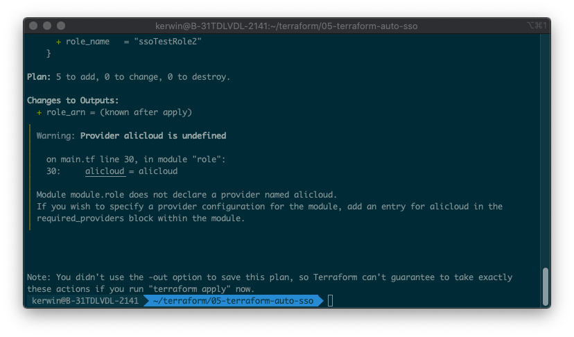
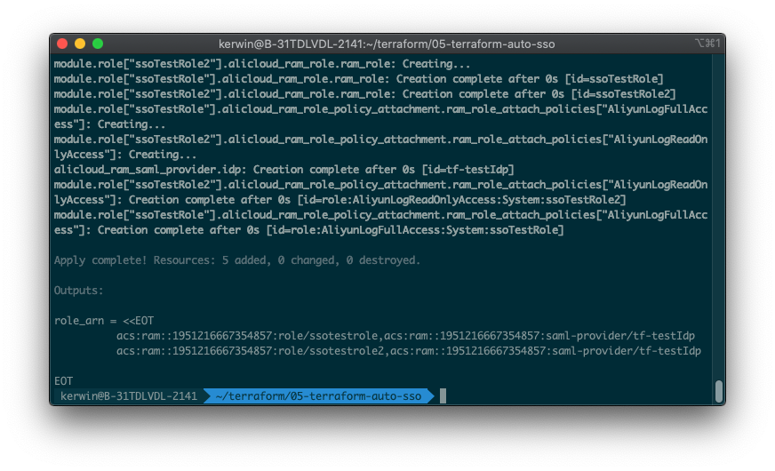

# 单账号SSO自动化配置

## 方案介绍

本方案使用Terraform自动化执行，在用户指定的账号下创建Idp，并且创建关联该Idp的若干个RAM角色。

## 前置条件

- 确保在当前环境已经安装好Terraform
- 确保已持有用户AK且用户有AliyunRamFullAccess权限
- 确保已获得Idp的meta.xml元文件

## 操作步骤

1. 下载代码，解压到某个目录。

2. 打开settings.tfvars文件，修改文件配置项：

   - 将前置条件中的AK、AK Secret填入`access_key`, `secret_key`内

   - 根据自身需要修改`ram_roles`

     ```tfvars
     # 角色列表
     ram_roles = {
       "ssoTestRole": {
         description = "Test for Terraform"
         policies = [
           "AliyunLogFullAccess"
         ]
       },
       "ssoTestRole2": {
         description = "Test for Terraform"
         policies = [
           "AliyunLogReadOnlyAccess"
         ]
       }
     }
     ```

   - 根据自身需要修改idp配置信息，其中`metadata`存放Idp xml元文件路径

     ```tfvars
     # idp名称
     saml_provider_name = "tf-testIdp"
     
     # idp元数据xml文件路径
     metadata = "./meta.xml"
     ```

3. 在目录下运行`terraform init`

4. 运行`terraform plan -var-file=settings.tfvars`，检查资源信息是否正常创建。

   

5. 运行`terraform apply -var-file=settings.tfvars`，自检成功后输入*yes*开始运行。运行成功后控制台打印出角色arn和idp arn。

   