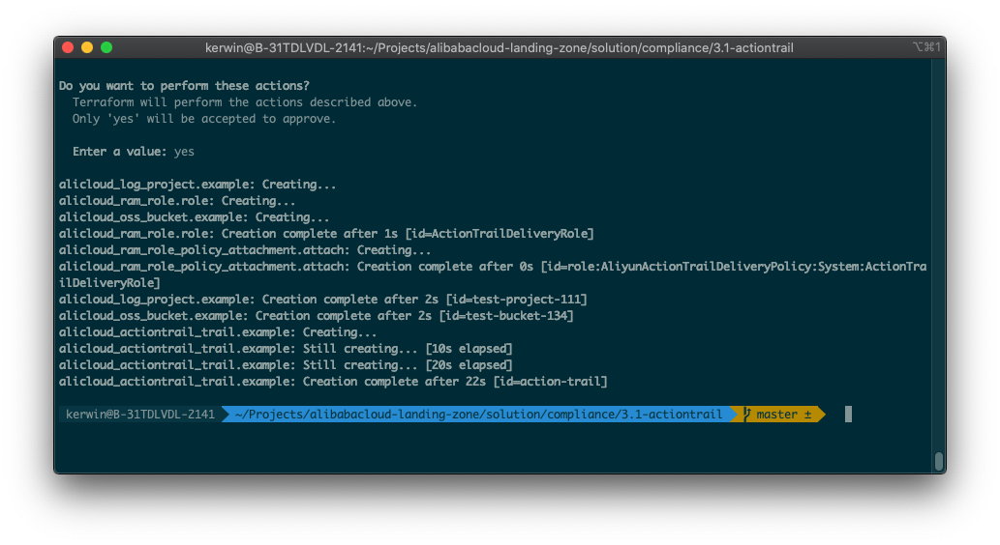
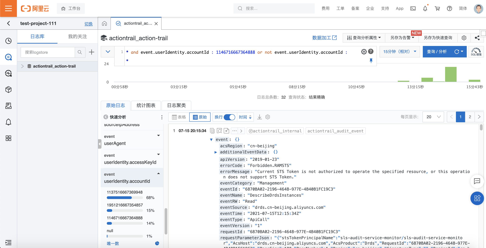
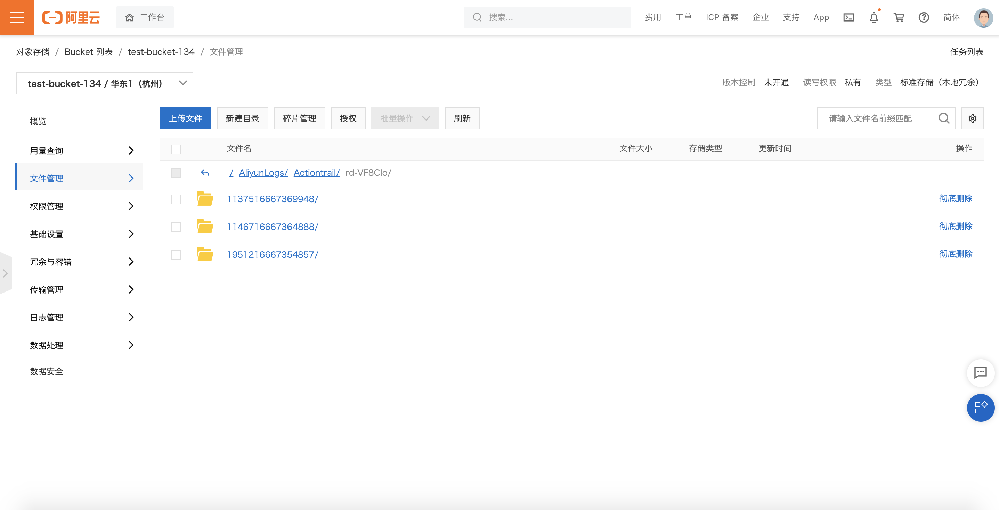

# 企业级中心化审计架构

## 方案介绍

本方案使用Terraform自动化执行。在企业管理账号RD下，用户指定**日志审计账号**。Terraform将在日志审计账号中创建用于存储所有成员账号的审计日志的SLS日志库和OSS对象存储Bucket。企业管理账号下的操作审计中，将会创建跟踪，将操作审计事件持续保存到日志审计账号下的日志服务Logstore和OSS Bucket中。

## 前置条件

- 确保在当前环境已经安装Terraform。
- 确保企业管理账号已开启资源目录服务，日志审计账号中已经开通SLS服务。
- 确保已持有企业管理账号下的RAM用户AK且用户有权限完成操作，包括：AliyunSTSAssumeRoleAccess、AliyunActionTrailFullAccess、AliyunResourceDirectoryReadOnlyAccess权限。

## 操作步骤

1. 下载代码包，解压到某个目录。

2. 用编辑器打开settings.tfvars文件，根据文件注释，修改配置项。

3. 在目录下运行`terraform init`

4. 运行`terraform plan -var-file=settings.tfvars`，检查是否报错，如果报错，请检查第二步中的配置项是否正确。

5. 运行`terraform apply -var-file=settings.tfvars`，自检成功后输入*yes*开始运行，如果报错请根据报错信息进行排查，检查是否重名或者权限不足。完成后结果图如下：

   

6. 登录日志审计账号，可以在SLS服务中看见Project和Logstore已经成功创建并且RD中所有成员账号的审计日志已经成功投递。同时OSS中，Bucket也成功创建并收集到所有成员账号的操作审计数据。

   

   

   

   

