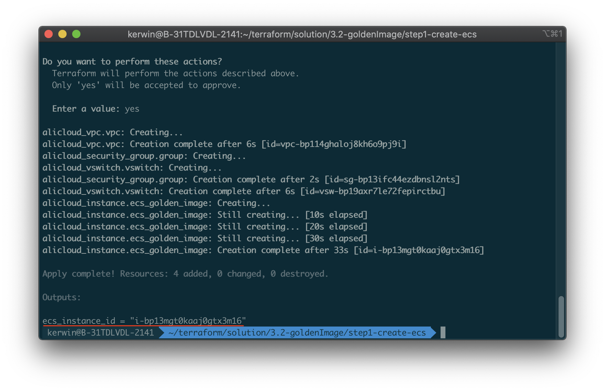
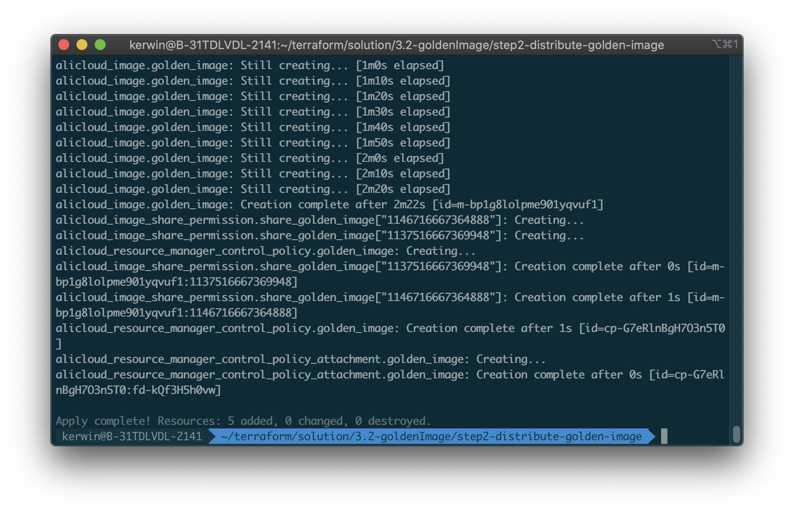
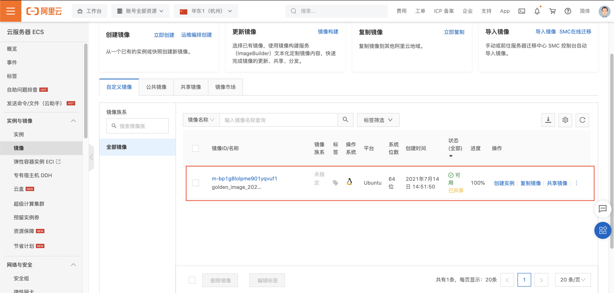
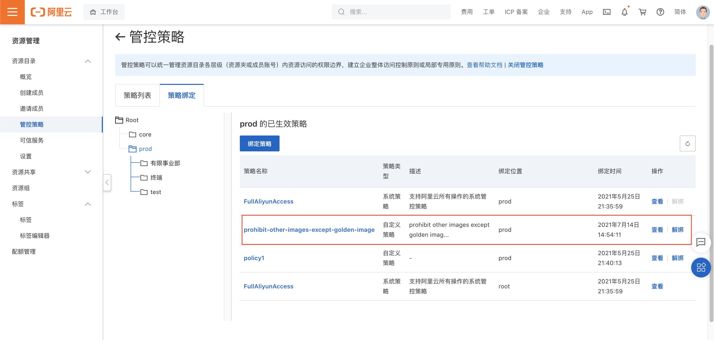
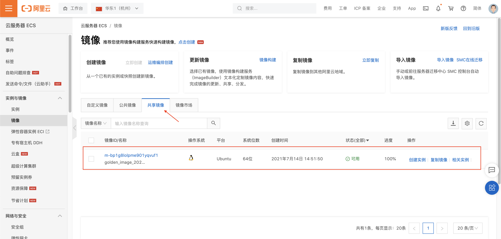

# 多账号Golden Image

## 方案介绍

本方案使用Terraform自动化执行，分为两步执行。**第一步**需要创建一台 ECS（用于ECS镜像的生成，如果已有ECS可跳过第一步），并通过 user-data 的方式让 ECS 在创建完成后执行相关自定义脚本，通过该脚本实现镜像内的操作，也可以通过云助手命令的方式完成镜像内操作。创建ECS的Terraform脚本可以参考 `step1-create-ecs` 这个文件夹下的内容；第二步根据ECS的实例ID（第一步中得到的，或者直接在ECS控制台查看），创建自定义镜像，并将镜像下发给所有成员账号。同时，对指定的资源夹下发管控策略，其中的成员账号只能使用该Golden Image创建ECS，而不允许使用其他镜像。

## 前置条件

- 确保在当前环境已经安装Terraform。
- 确保企业管理账号已开启资源目录服务。
- 确保已持有企业管理账号下的RAM用户AK且用户有权限完成操作，包括：AliyunResourceDirectoryFullAccess、AliyunECSFullAccess、AliyunVPCFullAccess权限。

## 操作步骤

1. 下载代码包，解压到某个目录。目录结构如下：

   ```
   ├── step1-create-ecs              // 第一阶段：创建ECS
   │   ├── main.tf                   // 第一阶段操作入口文件，无需修改
   │   ├── settings.tfvars           // 配置文件，可以根据自身需要修改
   │   └── variables.tf              // 第一阶段用到的变量定义，无需修改
   │       
   └── step2-distribute-golden-image // 第二阶段：下发Golden Image
       ├── main.tf                   // 第二阶段操作入口文件，无需修改
       ├── settings.tfvars           // 配置文件，可以根据自身需要修改
       └── variables.tf              // 第二阶段用到的变量定义，无需修改
   ```

6. 如果使用已有ECS作为镜像，则可以跳过**第一步**，直接从官网控制台直接获取**ECS实例ID**；如果希望新建一台ECS制作镜像，则可以使用step1中的terraform脚本，修改`user_data`字段个性化ECS实例。

3. 第一步：

   - 进入`step1-create-ecs`文件夹，打开`settings.tfvars`文件，根据注释，修改文件的配置项。

   - 运行`terraform plan -var-file=settings.tfvars` ，检查是否有报错，如果有报错，请检查第二步中的配置项是否正确。

   - 运行 `terraform apply -var-file=settings.tfvars`，自检成功后输入 *yes* 开始运行。运行成功后，在企业管理账号下会在指定区域创建一个ECS实例，并将该ECS实例ID打印在控制台上。

     

4. 第二步：

   - 进入`step2-distribute-golden-image`文件夹，打开`settings.tfvars`文件，根据注解修改文件的配置项

     - 企业管理账号的AK，SK

     - ECS实例所在的地区，同时也会将镜像下发到成员账号的这个地区

     - 制作镜像参数：将**第一步**中的ECS实例ID填入`ecs_instance_id`，`platform`字段表示指定数据盘快照作为创建镜像的系统盘的数据源后，指定系统盘的操作系统平台。

       ```tfvars
       # 制作镜像的ECS实例ID
       ecs_instance_id = "i-bp13mgt0kaaj0gtx3m16"
       ```

     - 下发管控策略的资源夹ID

   - 运行`terraform plan -var-file=settings.tfvars` ，检查是否有报错，如果有报错，请检查第二步中的配置项是否正确。

   - 运行 `terraform apply -var-file=settings.tfvars`，自检成功后输入 *yes* 开始运行。

     

   - 运行成功后，会在企业管理账号下创建一个名为`golden_image_%{currentTime}`的镜像，并且显示**已共享**。并且在企业管理账号的**资源管理>管控策略**中，对应的资源夹下会创建并绑定名为`prohibit-other-images-except-golden-image`策略。

     

     

   - 同时，成员账号中在**共享镜像**页面中会收到该镜像。

     

