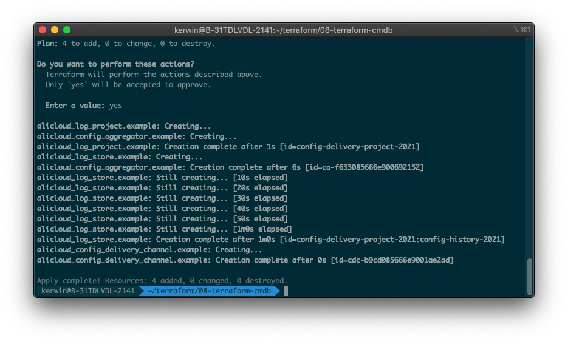
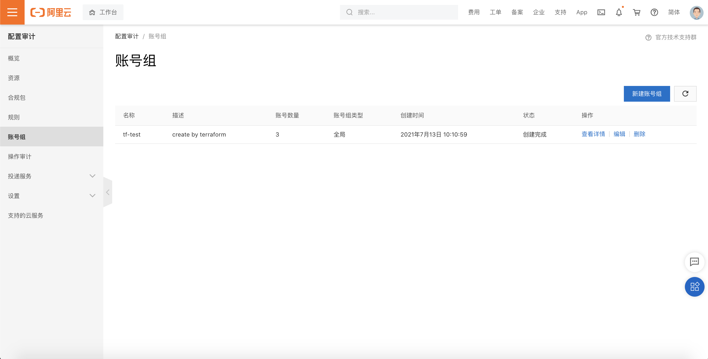
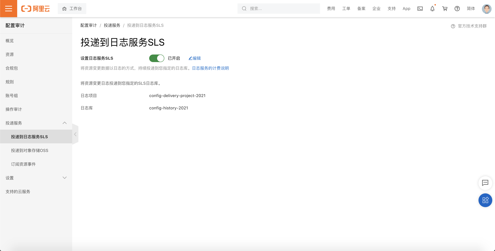
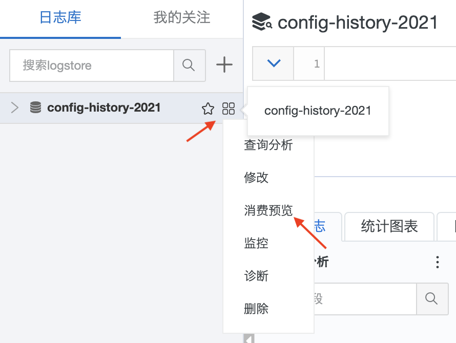
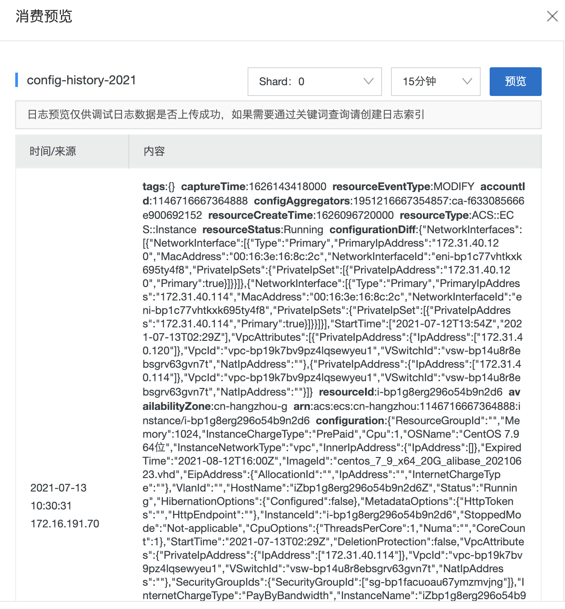

# 同步云上配置到企业CMDB

## 方案介绍

本方案使用Terraform自动化执行，将企业管理账号本身和旗下所有成员账号添加到全局账号组中，并按照用户设置选择其中一个账号为日志审计账号（LoggingAccount）。在日志审计账号中，会创建用于存储CMDB数据的日志服务project和logstore，并在企业管理账号中设置数据投递至该project和logstore中。方案完成后可以通过日志审计账号下的logstore的“消费预览”功能看到配置变更数据。

## 前置条件

- 确保在当前环境已经安装Terraform。
- 确保企业管理账号已开启资源目录服务。
- 确保已持有企业管理账号下RAM用户AK且用户有权限完成操作，包括：AliyunResourceDirectoryReadOnlyAccess、AliyunSTSAssumeRoleAccess、AliyunConfigFullAccess权限。

## 操作步骤

1. 下载代码包，解压到某个目录。目录结构如下：

   ```
   ├── main.tf         // 操作入口文件，无需修改
   ├── settings.tfvars // 配置文件，可以根据自身需要修改
   ├── README.md       // 操作文档，无需修改
   └── variables.tf    // 用到的变量定义，无需修改
   ```

2. 使用编辑器打开 `step1/settings.tfvars` 这个文件，根据注释，修改该文件内的配置项：

   - 将主账号的AK、SK填入`master_account_access_key`和`master_account_secret_key`中
   - 选择主账号RD下的任一成员账号作为日志审计账号，填写该账号的uid到`cmdb_account_uid`中
   - 设置用于存储CMDB数据的proeject和logstore名称，注意project名称是**全局唯一**的，不能重复。

3. 进入项目目录，运行`terraform init`

4. 运行`terraform plan -var-file=settings.tfvars`，检查是否有报错，如果有报错，请检查第二步中的配置项是否正确；

5. 运行`terraform apply -var-file=settings.tfvars`，自检成功后输入*yes*开始运行。运行结果如下：

   

6. 可以登录企业管理账号，进入“配置审计”，在“账号组”中查看是否成功创建全局账号组；以及查看“投递服务”-“投递到日志服务SLS”，是否成功配置数据投递。

   

   

7. 可以登录日志审计账号的SLS服务，进入在terraform配置文件中设置的project中，在对应logstore的消费预览可以看到数据已成功投递。

   

   

   