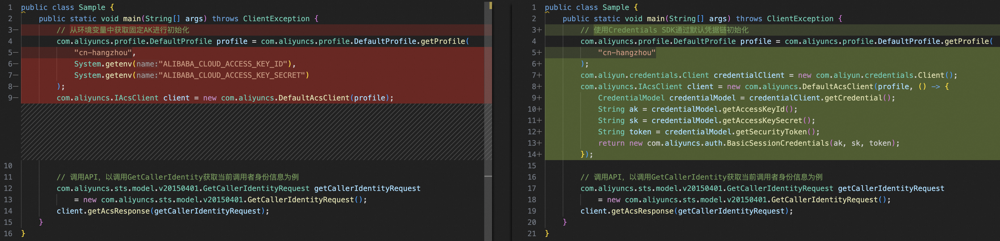

### 说明
阿里云V1.0 SDK是较早使用版本，稳定性良好，不少老用户习惯于原版SDK的开发，本示例为用户提供一个简练的使用指南。对于新用户则建议直接使用新版SDK，老用户也建议尽早迁移到新版SDK。

本示例完成SDK客户端的初始化后，调用API：GetCallerIdentity获取当前调用者身份信息。

如果您需要从长期固定AccessKey的使用方式进行迁移，只需修改少量代码即可完成，如下图所示，左侧一栏是使用固定AccessKey初始化阿里云SDK，右侧一栏是使用Credentials工具初始化阿里云SDK。



#### 环境要求
该示例代码需要在ECS环境中执行，执行前，请确保运行环境中已配置好Java和Maven。
1. Java Development Kit (JDK)：确保已安装Java 8或更高版本。 
2. Apache Maven：确保已安装Maven 3.6.0或更高版本。

运行以下命令来检查Java安装：
```bash
java -version
```
运行以下命令来检查Maven安装：
```bash
maven -version
```
### CredentialsSample
该示例代码演示了初始化凭据客户端（初始化方式可参考sdk2中的示例，本示例采用默认凭据链方式），再使用凭据客户端的凭据信息初始化V1.0 SDK客户端。

Credentials工具会在环境变量中获取`ALIBABA_CLOUD_ECS_METADATA`（ECS实例RAM角色名称），若存在，程序将会通过ECS的元数据服务（Meta Data Server）获取ECS实例RAM角色的STS Token作为默认凭据信息。强烈建议配置环境变量`ALIBABA_CLOUD_ECS_IMDSV2_ENABLE=true`开启在加固模式下获取STS Token。

在ECS中配置环境变量：
```bash
export ALIBABA_CLOUD_ECS_METADATA=<role-name>
export ALIBABA_CLOUD_ECS_IMDSV2_ENABLE=true
```
运行示例代码：
```bash
mvn exec:java -Dexec.mainClass="org.example.sdk1_0.CredentialsSample" -e -q
```

### EnvConfigSample
该示例代码通过配置环境变量完成SDK客户端，如果定义了环境变量`ALIBABA_CLOUD_ECS_METADATA`且不为空，程序会将该环境变量的值作为角色名称，通过ECS的元数据服务（Meta Data Server）获取ECS实例RAM角色的STS Token作为默认凭据信息。

在ECS中配置环境变量：
```bash
export ALIBABA_CLOUD_ECS_METADATA=<role-name>
```
运行示例代码：
```bash
mvn exec:java -Dexec.mainClass="org.example.sdk1_0.EnvConfigSample" -e -q
```
### RoleConfigSample
该示例代码通过配置`InstanceProfileCredentialsProvider`，指定ECS实例角色名完成客户端初始化。

运行示例代码：
```bash
mvn exec:java -Dexec.mainClass="org.example.sdk1_0.RoleConfigSample" -e -q
```
